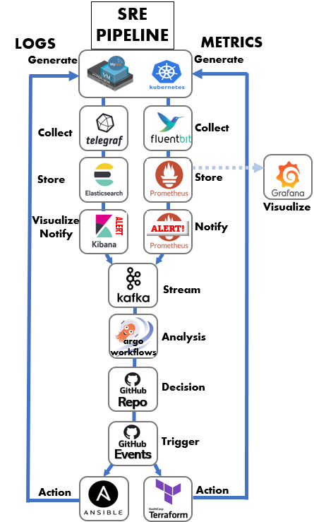

**SRE Course**

## **Topology**

## Overview Outline

**\-------------------------Day 1------------------------------------**  
**Infrastructure as Code: Terraform – AWS Hands on**  
**Configuration as Code: Ansible**  
**\----------------------------Day 2------------------------------------**  
**Github Actions**  
**Telegraf**  
**Prometheus, Alert Manager, Grafana**  
**Fluent Bit**  
**ELK with Kafka and elastic alert**  
**\----------------------------Day 3------------------------------------**  
**Argo Workflow**  
**Complete Solution Labs - Challenges**  

Detailed Labs

1.  **Terraform**
    1.  Prerequisites & AWS Exploration
    2.  Terraform and AWS CLI Installation
    3.  Terraform Basic Commands
    4.  Fundamental Manifest Section
    5.  Resource Meta-Argument - depends\_on, count, For\_Each
    6.  Terraform Variables
    7.  Terraform Modules
    8.  Create VM in EC2 (small) commit to Github
    9.  Create Kubernetes Deployment and Service commit to Github
    10.  Create S3 storage commit to Github
2.  **Ansible**
    1.  CLI Tools & Ad-Hoc Commands
    2.  Linters & Tools
    3.  Inventory
    4.  Playbooks
    5.  Variables and Inclusions
    6.  Loops
    7.  Mount S3 storage on EC2 VM (github)
    8.  Install MySQL on VM (github)
    9.  (Later in class will use Ansible to deploy Telegraf and FluentBit)
3.  **Github Actions**
    1.  Basic Config and usage
    2.  Create an Actions (per folder)
4.  **Telegraf**
    1.  Telegraph Plugins
        1.  MySQL
        2.  Kubernetes
        3.  Linux
        4.  Libvirt
        5.  Python
    2.  Create a Telegraf Configuration for Prometheus
    3.  Install Telegraf with Ansible on VM with MySQL Plugin
5.  **Prometheus, Alert Manager, Grafana**
    1.  K8S Data collection
        1.  Adjust Settings
    2.  Data Sources
        1.  Configure Data Source
        2.  Importing Data
    3.  Prometheus PromQL
        1.  Nested Expressions
        2.  Metric & Data Types
        3.  Feature Flags
        4.  Subqueries
        5.  Operators
        6.  Functions
    4.  Grafana Dashboards
        1.  Using
        2.  Importing
        3.  Cloning
    5.  Dashboard Creation with PromQL
        1.  K8S Dashboard
        2.  Virtual Machine Dashboard
        3.  MySQL Dashboard
        4.  Challenge Lab (give problem – not solution)
    6.  Alert Manager
        1.  Configuring Alert Rules
            1.  Resource Approaching Capacity Limit - VM
            2.  Nodes in a NotReady State – K8S
            3.  Processing Jobs Not Running – MySQL
            4.  Challenge Labs
6.  **Fluent Bit**
    1.  Fluent bit Service, Input, Filter, and Output Sections
    2.  Install fluentbit w/Ansible
    3.  verify logs to Elasticsearch
    4.  Configuring Parser
        1.  Parse JSON
        2.  Selecting specific record keys
        3.  Calculate Average Value
        4.  Grouping Results and Window
        5.  Parsing Structured Logs
        6.  Parsing Unstructured Logs
        7.  Parsing Multi-Line Logs
        8.  Using and Modifying Common Parsers
            1.  Kubernetes
            2.  Linux
            3.  MySQL
    5.  Labels and Tags
    6.  Environment Variables
    7.  LifeCycle Variables
    8.  Selecting specific record keys
    9.  Grouping Results and Window
7.  **Logstash Kibana Elastic**
    1.  Querying Data
    2.  Filtering logs per tags, Node, Pods.
    3.  Query Challenge
    4.  Kibana Dashboard (geo location maybe)
    5.  Alerting
        1.  Create and manage rules
        2.  Rule types
        3.  Index threshold
        4.  Elasticsearch query
        5.  Create a logs threshold rules
        6.  K8S Alert
        7.  Linux Alert
        8.  MySQL
        9.  Challenge LAb
8.  **Argo Workflows**
    1.  Argo CLI
    2.  Create a simple workflow
    3.  Workflow Templates
        1.  Container Example
        2.  Resource Example
        3.  Template for Ansible
        4.  Template for Terraform
        5.  Template for Windows - powershell
    4.  Multi-Step workflow
    5.  Workflow Exit Handler
    6.  Workflows Cron Jobs
    7.  Workflow Kubernetes Jobs
    8.  Secrets and Config Maps
    9.  Argo Workflows UI

# **Lab Dependencies**

**0\.  SRE Jumphost Build, Each Student has a folder in Github to store stuff**

**All Password:  #SRERocks33**

1.  **Terraform**
    1.  Create VM in EC2 (small) commit to Github
        1.  **IP address, Username, Password of VM stored in INFO\_VM.txt**
    2.  Create Kubernetes Deployment and Service commit to Github
        1.  Non Dependent. Delete at end of lab.
    3.  Create S3 storage commit to Github
        1.  **S3 information ID and such stored in INFO\_S3.txt**
2.  **Ansible**
    1.  Mount S3 storage on EC2 VM (github)
    2.  Install MySQL on VM (github)
        1.  **MySQL IP, User, and Password stored in INFO\_MYSQL.txt**
3.  **Github Actions**
    1.  Create an Actions (per folder)
        1.  **When change made to student folder, terraform and ansible run**
4.  **Telegraf**
    1.  Alert Manager
        1.  **Configuring Alert Rules**
            1.  **Resource Approaching Capacity Limit - VM**
            2.  **Nodes in a NotReady State – K8S**
            3.  **Processing Jobs Not Running – MySQL**
            4.  **Challenge Labs**
5.  **Fluent Bit**
    1.  **Install fluentbit w/Ansible on Student VM (Linux, MySQL)**
    2.  **Install fluentbit w/Ansible on  Jumphost  (Linux, Kubernetes)**
6.  **Logstash Kibana Elastic**
    1.  Alerting
        1.  **K8S Alert**
        2.  **Linux Alert**
        3.  **MySQL**
        4.  **Challenge LAb**
7.  **Argo Workflows**
    1.  **Workflow VM Jobs**
    2.  **Workflow MySQL Jobs**
    3.  **Workflow Kubernetes Jobs**
